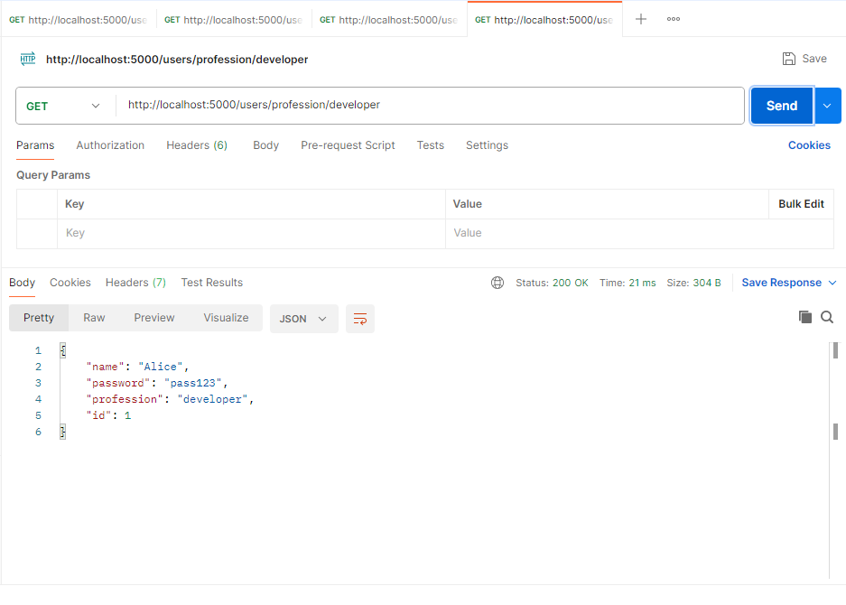
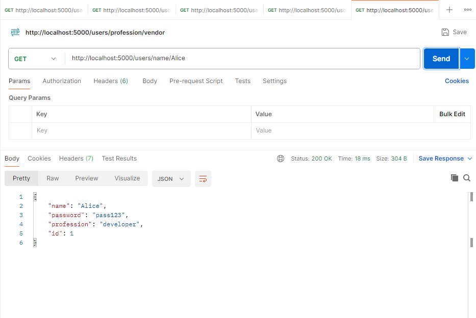
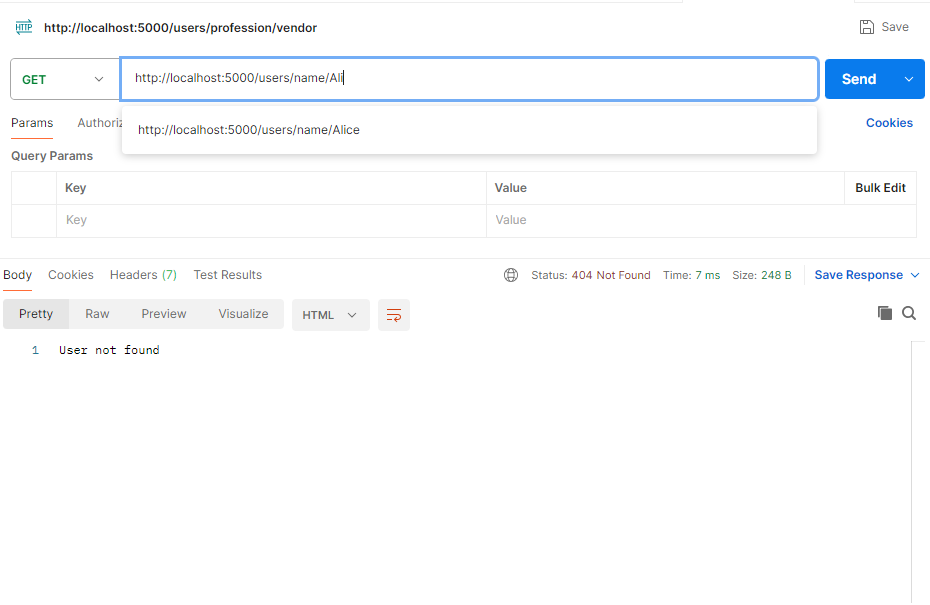

<!-- Please update value in the {}  -->

<h1 align="center">My First Node Js Backend Server</h1>

<!-- OVERVIEW -->

## Overview
This application/project was created as a submission to my Web Technologies Course assign on how to create a server with endpoint using node js with express

## Screenshots
- All Users Response

- Users/:id Response

- Users/:id error Response

- Users/profession/:profession Response

- Users/profession/:profession error Response

- Users/name/:name Response

- Users/name/:name error Response

### Built With

<!-- This section should list any major frameworks that you built your project using. Here are a few examples.-->

- [Node JS](https://www.w3schools.com/html/)
- [Express JS](https://www.w3schools.com/css/)
- [Javascript](https://www.w3schools.com/js/)

## Features

<!-- List the features of your application or follow the template. Don't share the figma file here :) -->
- Returns all users on entering /users endpoint
- Returns a user by id on entering /users/:id endpoint
- Returns a user by profession on entering /users/profession/:profession endpoint
- Returns a user by name on entering /users/name/:name endpoint

## Discussions/Takeaways
- I learnt that request parameters alway return values as strings and parseint is use to convert a string to an integer
- Renaming the screenshots to preferred names.
- assigning each photo to a response.
- Intializing committing & pushing the repo to github.
- how to install express through the terminal.

## Contact
- GitHub [@AdzeyenaOpei](https://github.com/AdzeyenaOpei)